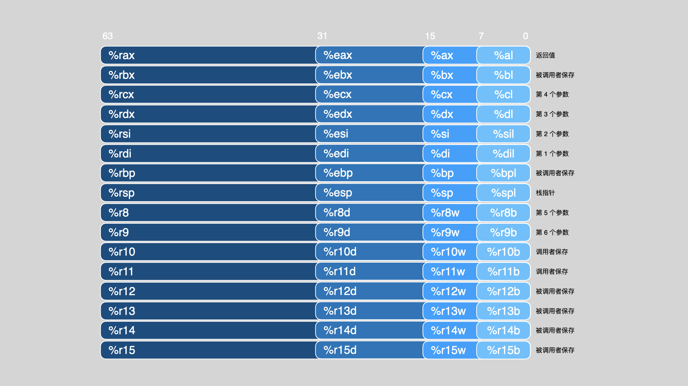

# 第 3 章 程序的机器级表示

计算机工业已经完成从 32 位到 64 位机器的过渡。32 位机器只能使用大概 4GB（2<sup>32</sup>字节）的随机访问存储器

> [!NOTE|style:flat|label:机器位数与内存大小的关系]

> 32 位机器可使用的内存地址空间范围大小为 2<sup>32</sup> 个地址，也就是 4 × 2<sup>10</sup> × 2<sup>10</sup> 个地址空间，而**每个地址空间本身指向一个字节**（这是计算机内存组织本身决定的，因为字节是计算机本身逻辑组织的最小单位。「位」可理解为物理组织上的最小单位。一个整数型数据对象，其大小为 4 个字节，说明存储该数据对象的地址和其相邻对象的地址间偏移为 4），因而这里内存大小可直接写作 4GB。
>
> 这里的辨析，可结合 [9.1 物理和虚拟内存](../Part02/Ch09.md#91-物理和虚拟寻址) 章节来理解：计算机系统的主存被组织成一个由 M 个连续的字节大小的单元组成的数组。每字节都有一个唯一的物理地址（Physical Address，主存 PA）。
>
> 对于 64 位机器，其内存空间可以多达 256TB（2<sup>48</sup> 字节），而且很容易就能扩展至 16EB（2<sup>64</sup> 字节）。所以可以看到，机器可表示的内存空间大小实际和机器字长有很大的关系，机器字长决定了机器可表示的内存空间大小上限。

## 3.1 历史观点

## 3.2 程序编码

### 3.2.1 机器级代码

对于机器级编程，两种抽象尤为重要：

1. 指令集体系结构或指令集架构（Instruction Set Architecture, ISA）。用于定义机器级程序的格式和行为，它定义了处理器状态、指令的格式，以及每条指令对状态的影响。

2. 虚拟内存。机器级程序使用的内存地址是虚拟地址，提供的内存模型看上去是一个非常大的字节数组。

x86-64 的机器代码和原始的 C 代码差别非常大。一些通常对 C 语言程序员隐藏的处理器状态都是可见的：

- **程序计数器**（通常称为“PC”，在 x86-64 中用 %rip 表示）给出将要执行的下一条指令在内存中的地址。

- 整数**寄存器文件**包含 16 个命名的位置，分别存储 64 位的值。这些寄存器可以存储地址（对应于 C 语言的指针）或整数数据。有的寄存器被用来记录某些重要的程序状态，而其他的寄存器用来保存临时数据，例如过程的参数和局部变量，以及函数的返回值。

- 条件码寄存器保存着最近执行的算术或逻辑指令的状态信息。它们用来实现控制或数据流中的条件变化，比如说用来实现 if 和 while 语句。

- 一组向量寄存器可以存放一个或多个整数或浮点数值。

### 3.2.2 代码示例

### 3.2.3 关于格式的注解

## 3.3 数据格式

由于是从 16 位体系结构扩展成 32 位的，Intel 用术语“字（word）”表示 16 位数据类型。因此，称 32 位数为“双字（double words）”，称 64 位数为“四字（quad words）”

| C 声明 | Intel 数据类型 | 汇编代码后缀 | 大小（字节） |
| :-: | :-: | :-: | :-: |
| `char` | 字节 | b | 1 |
| `short` | 字 | w | 2 |
| `int` | 双字 | l | 4 |
| `long` | 四字 | q | 8 |
| `char *` | 四字 | q | 8 |
| `float` | 单精度 | s | 4 |
| `double` | 双精度 | l | 8 |

后缀‘l’用来表示双字，因为 32 位数被看成是“长字（long word）”。注意，汇编代码也使用后缀‘l’来表示 4 字节整数和 8 字节双精度浮点数。这不会产生歧义，因为浮点数使用的是一组完全不同的指令和寄存器。

## 3.4 访问信息

一个 x86-64 的中央处理单元（CPU）包含一组 16 个存储 64 位值的**通用目的寄存器**[^1]。这些寄存器用来存储整数数据和指针。



<center>图 3-1 整数寄存器。所有 16 个寄存器的低位部分都可以作为字节、字（16 位）、双字（32 位）和四字（64 位）数字来访问</center>

对于诸多指令，比如复制和生成 1 字节、2 字节、4 字节和 8 字节值。当这些指令以寄存器作为目标时，对于生成小于 8 字节结果的指令，寄存器中剩下的字节会怎样，对此有两条规则：生成 1 字节和 2 字节数字的指令会保持剩下的字节不变；**生成 4 字节数字的指令会把高位 4 个字节置为 0**。后面这条规则是作为从 IA32 到 x86-64 的扩展的一部分而采用的。

### 3.4.1 操作数指令符

| 类型 | 格式 | 操作数值 | 名称 |
| :-: | :-: | :-: | :-: |
| 立即数 | $_Imm_ | _Imm_ | 立即数寻址 |
| 寄存器 | r_<sub>a</sub>_ | R[r_<sub>a</sub>_] | 寄存器寻址 |
| 存储器 | _Imm_ | M[_Imm_] | 绝对寻址 |
| 存储器 | (r_<sub>a</sub>_) | M[R[r_<sub>a</sub>_]] | 间接寻址 |
| 存储器 | _Imm_(r_<sub>b</sub>_) | M[_Imm_+R[r_<sub>b</sub>_]] | （基址+偏移量）寻址 |
| 存储器 | (r_<sub>b</sub>_, r_<sub>i</sub>_) | M[R[r_<sub>b</sub>_]+R[r_<sub>i</sub>_]] | 变址寻址 |
| 存储器 | _Imm_(r_<sub>b</sub>_, r_<sub>i</sub>_) | M[_Imm_+R[r_<sub>b</sub>_]+R[r_<sub>i</sub>_]] | 变址寻址 |
| 存储器 | (, r_<sub>i</sub>_, _s_) | M[R[r_<sub>i</sub>_]·_s_] | 比例变址寻址 |
| 存储器 | _Imm_(, r_<sub>i</sub>_, _s_) | M[_Imm_+R[r_<sub>i</sub>_]·_s_] | 比例变址寻址 |
| 存储器 | (r_<sub>b</sub>_, r_<sub>i</sub>_, _s_) | M[R[r_<sub>b</sub>_]+R[r_<sub>i</sub>_]·_s_] | 比例变址寻址 |
| 存储器 | _Imm_(r_<sub>b</sub>_, r_<sub>i</sub>_, _s_) | M[_Imm_+R[r_<sub>b</sub>_]+R[r_<sub>i</sub>_]·_s_] | 比例变址寻址 |

### 3.4.2 数据传送指令

最简单的数据传送指令——MOV 类。MOV 类由四条指令组成：`movb`、`movw`、`movl` 和 `movq`。这些指令都执行同样的操作；主要区别在于它们操作的数据大小不同：分别是 1、2、4 和 8 字节。

| 指令 | 效果 | 描述 |
|:-: | :-: | :-:| 
| `MOV S, D` | D ← S | 传送 |
| `movb` | | 传送字节 |
| `movw` | | 传送字 |
| `movl` | | 传送双字 |
| `movq` | | 传送四字 |
| `movabsq I, R` | R ← I | 传送绝对的四字 |

x86-64 的指令限制：传送指令的两个操作数不能都指向内存位置。将一个值从一个内存位置复制到另一个内存位置需要两条指令——第一条指令将源值加载到寄存器中，第二条将该寄存器值写入目的位置。

大多数情况中，MOV 指令只会更新目的操作数指定的那些寄存器字节或内存位置。唯一的例外是 `movl` 指令以寄存器作为目的时，它会把该寄存器的高位 4 字节设置为 0。

上述表中记录的最后一条指令是处理 64 位立即数数据的。常规的 `movq` 指令只能以表示为 32 位补码数字的立即数作为源操作数，然后把这个值拓展得到 64 位的值放到目的位置。`movabsq` 指令能够以任意 64 位立即数值作为源操作数，并且只能以寄存器作为目的。

`cltq` 指令，其效果为 `%rax ← 符号拓展(%eax)`，即把 `%eax` 符号拓展到 `%rax`。需要注意的是，`cltq` 指令只作用于寄存器 `%eax` 和 `%rax`。

### 3.4.3 数据传送示例

C 语言中所谓的“指针”其实就是地址。间接引用指针就是将该指针放在一个寄存器中，然后在内存引用中使用这个寄存器。对于局部变量而言，通常是将其保存在寄存器中，而不是内存中。访问寄存器比访问内存要快得多。

### 3.4.4 压入和弹出栈数据

| 指令 | 效果 | 描述 |
| :-: | :-: | :-: |
| `pushq S` | R[%rsp] ← R[%rsp] - 8;<br>M[R[%rsp]] ← S | 将四字压入栈 |
| `popq D` | D ← M[R[%rsp]];<br>R[%rsp] ← R[%rsp] + 8 | 将四字弹出栈 |

## 3.5 算术和逻辑操作

### 3.5.1 加载有效地址

**加载有效地址**（load effective address）指令 `leaq` 实际上是 `movq` 指令的变形。它的指令形式是从内存读数据到寄存器，但**实际上它根本就没有引用内存**。它的第一个操作数看上去是一个内存引用，但该指令并不是从指定的位置读入数据，而是将有效地址写入到目的操作数。这条指令可以为后面的内存引用产生指针。另外，它还可以简洁地描述普通的算术操作。例如，如果寄存器 %rdx 的值为 x，那么指令 `leaq 7(%rdx, %rdx, 4), %rax` 将设置寄存器 %rax 的值为 5x + 7。编译器经常发现 leaq 的一些灵活用法，根本就与有效地址计算无关。目的操作数必须是一个寄存器。

### 3.5.2 一元和二元操作

### 3.5.3 移位操作

### 3.5.4 讨论

对于大多数指令，既可以用于无符号运算，也可以用于补码运算。只有右移操作需要区分有符号和无符号数。这个特性使得补码运算成为实现有符号整数运算的一种比较好的方法的原因之一。

### 3.5.5 特殊的算术操作

x86-64 指令集对 128 位提供有限的算术操作支持。指令 `imulq` 可用于“双操作数”乘法指令，用于计算两个 64 位操作数的乘积。同时，x86-64 还提供两条不同的“单操作数”乘法指令，用于计算两个 64 位值的全 128 位乘积。一个是无符号数乘法（mulq），另一个是补码乘法（imulq）。这两条指令都要求一个参数必须存放在寄存器 %rax 中，另一个操作数作为指令的源操作数给出。计算得到的乘积结果，高 64 位存放在寄存器 %rdx 中，低 64 位存放在寄存器 %rax 中。虽然 imulq 这个名字可以用于两个不同的乘法操作，但汇编器可以根据计算操作数的数目来识别具体执行哪一条指令。

类似于单操作数乘法指令，单操作数除法指令的有符号除法指令 idivl 将寄存器 %rdx（高 64 位）和 %rax（低 64 位）中的 128 位数作为被除数，而除数作为指令的操作数给出。指令将商存放在寄存器 %rax 中，将余数存放在寄存器 %rdx 中。

## 3.6 控制

### 3.6.1 条件码

除了整数寄存器，CPU 还维护着一组单个位的**条件码**（condition code）寄存器，它们描述了最近的算术或逻辑操作的属性。可以检测这些寄存器来执行条件分支指令。最常用的条件码有：

- `CF`：进位标志。最近的操作使最高位产生了进位。可用来检测无符号操作的溢出。
- `ZF`：零标志。最近的操作得出的结果为 0。
- `SF`：符号标志。最近的操作得到的结果为负数。
- `OF`：溢出标志。最近的操作导致一个补码溢出——正溢出或负溢出。

`leaq` 指令不改变任何条件码，因为它是用来进行地址计算的。

除了上述算术运算指令会设置条件码之外，还有两类指令只设置条件码而不改变任何其他寄存器：

- CMP 指令根据两个操作数之差来设置条件码。除了只设置条件码而不更新目的寄存器之外，CMP 指令与 SUB 指令的行为是一样的。

- TEST 指令的行为与 AND 指令一样，除了它们只设置条件码而不改变目的寄存器的值。典型的用法是，两个操作数是一样的（例如，`testq %rax, %rax` 用来检查 %rax 是负数、零、还是正数），或其中的一个操作数是一个掩码，用来指示哪些位应该被测试。

### 3.6.2 访问条件码

条件码通常不会直接读取，常用的读取方法有三种：

1. 可以根据条件码的某种组合，将一个字节设置位 0 或 1。
2. 可以条件跳转到程序的某个其他的部分。
3. 可以有条件地传送数据。

对于第 1 种情况，可以使用一类名为 SET 的指令来实现，SET 类指令间的区别就在于它们如何组合使用条件码，这些指令名字的不同后缀指明了它们所考虑的条件码组合。值得与前面内容辨别区分的是，**这些后缀表示不同的条件而不是操作数的大小**。

一条 SET 指令的目的操作数是低位单字节寄存器元素（参考图 3-1）之一，或是一个字节的内存位置，指令会将这个字节设置成 0 或 1。为了得到一个 32 位或者 64 位的值，就必须要对高位清零。

| 指令 | 同义名 | 效果 | 设置条件 |
| :-: | :-: | :-: | :-: |
| `sete  D` | `setz` | D ← ZF | 相等 / 零 |
| `setne D` | `setnz` | D ← ~ZF | 不等 / 非零 |
| `sets  D` | | D ← SF | 负数 |
| `setns D` | | D ← ~SF | 非负数 |
| `setg  D` | `setnle` | D ← ~(SF ^ OF) & ~ZF | 大于（有符号 >） |
| `setge D` | `setnl` | D ← ~(SF ^ OF) | 大于等于（有符号 >=） |
| `setl  D` | `setnge` | D ← SF ^ OF | 小于（有符号 < ） |
| `setle D` | `setng` | D ← (SF ^ OF) &#124; ZF | 小于等于（有符号 <=） |
| `seta  D` | `setnbe` | D ← ~CF & ~ZF | 超过（无符号 >） |
| `setae D` | `setnb` | D ← ~CF | 超过或相等（无符号 >=） |
| `setb  D` | `setnae` | D ← CF | 低于（无符号 <） |
| `setbe D` | `setna` | D ← CF &#124; ZF | 低于或相等（无符号 <=） |

### 3.6.3 跳转指令

jmp 跳转指令是无条件跳转。它可以是**直接**跳转，即跳转目标是作为指令的一部分编码的；也可以是**间接**跳转，即跳转目标是从寄存器或内存位置中读出的。汇编语言中，直接跳转是给出一个标号作为跳转目标的，而间接跳转的写法是‘\*’后面跟一个操作数指示符。比如指令 `jmp *%rax` 是用寄存器 %rax 中的值作为跳转目标，而指令 `jmp *(%rax)` 以 %rax 中的值作为读地址，从内存中读出跳转目标。

| 指令 | 同义名 | 跳转条件 | 描述 |
| :-: | :-: | :-: | :-: |
| jmp _Label_ | | 1 | 直接跳转 |
| jmp *_Operand_ | | 1 | 间接跳转 |
| je _Label_ | jz | ZF | 相等 / 零 |
| jne _Label_ | jnz | ~ZF | 不相等 / 非零 |
| js _Label_ | | SF | 负数 |
| jns _Label_ | | ~SF | 非负数 |
| jg _Label_ | jnle | ~(SF ^ OF) & ~ZF | 大于（有符号 >） |
| jge _Label_ | jnl | ~(SF ^ OF) | 大于等于（有符号 >=） |
| jl _Label_ | jnge | SF ^ OF | 小于（有符号 < ） |
| jle _Label_ | jng | (SF ^ OF) &#124; ZF | 小于等于（有符号 <=） |
| ja _Label_ | jnbe | ~CF & ~ZF | 超过（无符号 >） |
| jae _Label_ | jnb | ~CF | 超过或相等（无符号 >=） |
| jb _Label_ | jnae | CF | 低于（无符号 <） |
| jbe _Label_ | jna | CF &#124; ZF | 低于或相等（无符号 <=） |

同 SET 指令一样，一些底层的机器指令有多个名字。**条件跳转只能是直接跳转。**

### 3.6.4 跳转指令的编码

当执行 PC 相对寻址时，程序计数器的值是跳转指令后面的那条指令的地址，而不是跳转指令本身的地址。这种惯例可以追溯到早期的实现，当时的处理器会将更新程序计数器作为执行一条指令的第一步。

### 3.6.5 用条件控制来实现条件分支

C 语言中的 if-else 语句的通用形式模板如下：

```c
if (<test-expr>)
    <then-statement>
else
    <else-statement>
```

对于这种通用形式，汇编实现通常会使用下面这种形式，这里，使用 C 语法来描述控制流如下：

```c
    t = <test-expr>;
    if (!t)
        goto false;
    <then-statement>;
    goto done;
false:
    <else-statement>;
done:
```

### 3.6.6 用条件传送来实现条件分支

为了理解为什么基于条件数据传送的代码会比基于条件控制转移的代码性能要好，首先要了解一些关于现代处理器如何运行的知识：

> 处理器通过使用**流水线**（pipelining）来获得高性能，在流水线中，一条指令的处理要经过一系列的阶段，每个阶段执行所需操作的一小部分（例如，从内存取指令、确定指令类型、从内存读数据、执行算术运算、向内存写数据，以及更新程序计数器）。这种方法通过重叠连续指令的步骤来获得高性能，例如，在取一条指令的同时，执行它前面一条指令的算术运算。要做到这一点，要求能够事先确定要执行的指令序列，这样才能保持流水线中充满了待执行的指令。当机器遇到条件跳转（也称为“分支”）时，只有当分支条件求值完成之后，才能决定分支往哪边走。处理器采用非常精密的分支预测逻辑来猜测每条跳转指令是否会执行。只要它的猜测还比较可靠（现代微处理器设计试图达到 90% 以上的成功率），指令流水线中就会充满着指令。另一方面，错误预测一个跳转，要求处理器丢掉它为该跳转指令后所有指令已做的工作，然后再开始用从正确位置处起始的指令去填充流水线。正如我们会看到的，这样一个错误预测会招致很严重的惩罚，浪费大约 15~30 个时钟周期，导致程序性能严重下降。
>
> 无论测试的数据是什么，编译出来使用条件传送的代码所需的时间都是大约 8 个时钟周期。控制流不依赖于数据，这使得处理器更容易保持流水线是满的。

条件传送的指令名用 cmov 拼接条件名来标识。每条指令都有两个操作数：源寄存器或者内存地址 S，和目的寄存器 R。源和目的的值可以是 16 位、32 位或 64 位长。不支持单字节的条件传送。无条件传送指令的操作数的长度显式地编码在指令名中（例如 movw 和 movl），而汇编器可以从目标寄存器的名字推断出条件传送指令的操作数长度，所以对所有的操作数长度，都可以使用同一个指令名字。

| 指令 | 同义名 | 传送条件 | 描述 |
| :-: | :-: | :-: | :-: |
| cmove S, R | cmovz | ZF | 相等 / 零 |
| cmovne S, R | cmovnz | ~ZF | 不相等 / 非零 |
| cmovs S, R | | SF | 负数 |
| cmovns S, R | | ~SF | 非负数 |
| cmovg S, R | cmovnle | ~(SF ^ OF) & ~ZF | 大于（有符号 >） |
| cmovge S, R | cmovnl | ~(SF ^ OF) | 大于等于（有符号 >=） |
| cmovl S, R | cmovnge | SF ^ OF | 小于（有符号 < ） |
| cmovle S, R | cmovng | (SF ^ OF) &#124; ZF | 小于等于（有符号 <=） |
| cmova S, R | cmovnbe | ~CF & ~ZF | 超过（无符号 >） |
| cmovae S, R | cmovnb | ~CF | 超过或相等（无符号 >=） |
| cmovb S, R | cmovnae | CF | 低于（无符号 <） |
| cmovbe S, R | cmovna | CF &#124; ZF | 低于或相等（无符号 <=） |

简而言之，基于条件传送的实现方式就是对于两种逻辑分支的代码均进行计算求值，确定分支条件的值以后，再确定具体选择哪一个求值结果来作为逻辑执行的计算结果。同条件跳转不同，处理器无需预测测试的结果就可以执行条件传送。处理器只是读源值（可能是从内存中），检查条件码，然后要么更新目的寄存器，要么保持不变。

考虑如下典型的代码示例：

```c
v = <test-expr> ? <then-expr> : <else-expr>;
```

用条件控制转移的标准方法来编译这个表达式得到的结果形式：

```c
    if (!<test-expr>)
        goto false;
    v = <then-expr>;
    goto done;
false:
    v = <else-expr>;
done:
```

用基于条件传送的标准方法来编译这个表达式得到的结果形式：

```c
v = <then-expr>;
ve = <else-expr>;
t = <test-expr>;
if (!t) v = ve;
```

这个序列中的最后一条语句是用条件传送实现的——只有当测试条件 t 满足时，ve 的值才会被复制到 v 中。

但**不是所有的条件表达式都可以用条件传送来编译**。最重要的是，无论测试结果如何，上述抽象代码会对 `<then-expr>` 和 `<else-expr>` 都求值。如果这两个表达式中的任意一个可能产生错误条件或者副作用，就会导致非法的行为。比如 C 语言的指针判空条件：

```c
long cread(long *xp) {
    return (xp ? *xp : 0);
}
```

如果采用条件传送方式来编译，其汇编代码如下：

```asm
# xp in register %rdi
cread:
    movq   (%rdi), %rax  # v = *xp
    testq  %rdi, %rdi    # Test x
    movl   $0, %edx      # Set ve = 0
    cmove  %rdx, %rax    # If x == 0, v = ve
    ret                  # Return v
```

很明显，这会导致一个间接引用空指针的错误。所以，必须用分支代码来编译这段代码。

使用条件传送也不总是会提高代码的效率。例如，如果 `<then-expr>` 或者 `<else-expr>` 的求值需要大量的计算，那么当相对应的条件不满足时，这些工作就白费了。编译器必须考虑浪费的计算和由于分支预测错误所造成的性能处罚之间的相对性能。

根据对 GCC 的实验表明，只有当两个表达式都很容易计算时，例如表达式分别都只是一条加法指令，它才会使用条件传送。即使许多分支预测错误的开销会超过更复杂的计算，GCC 还是会使用条件控制转移。

所以，总的来说，条件数据传送提供了一种用条件控制转移来实现条件操作的替代策略。它们只能用于非常受限制的情况，但是这些情况还是相当常见的，而且与现代处理器的运行方式更契合。

### 3.6.7 循环

### 3.6.8 switch 语句

## 3.7 过程

### 3.7.1 运行时栈

### 3.7.2 转移控制

### 3.7.3 数据传送

### 3.7.4 栈上的局部存储

### 3.7.5 寄存器中的局部存储空间

### 3.7.6 递归过程

## 3.8 数组分配和访问

### 3.8.1 基本原则

### 3.8.2 指针运算

### 3.8.3 嵌套的数组

### 3.8.4 定长数组

### 3.8.5 变长数组

## 3.9 异质的数据结构

### 3.9.1 结构

### 3.9.2 联合

### 3.9.3 数据对齐

## 3.10 在机器级程序中将控制与数据结合起来

### 3.10.1 理解指针

### 3.10.2 应用：使用 GDB 调试器

### 3.10.3 内存越界引用和缓冲区溢出

### 3.10.4 对抗缓冲区溢出攻击

### 3.10.5 支持变长栈帧

## 3.11 浮点代码

### 3.11.1 浮点传送和转换操作

### 3.11.2 过程中的浮点代码

### 3.11.3 浮点运算操作

### 3.11.4 定义和使用浮点常数

### 3.11.5 在浮点代码中使用位级操作

### 3.11.6 浮点比较操作

### 3.11.7 对浮点代码的观察结论

## 3.12 小结

[^1]: 如图片丢失，亦可参考附录文字版寄存器说明图：[通用目的寄存器布局](../Others/Appendix.md#通用寄存器布局文字版)
